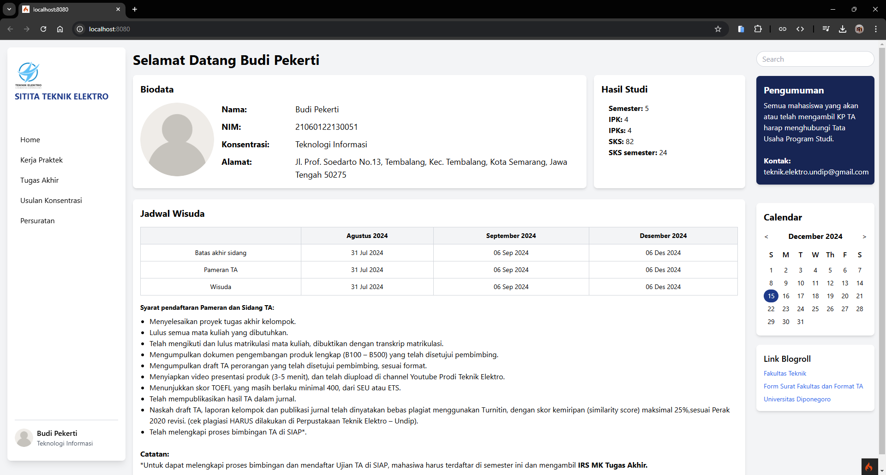
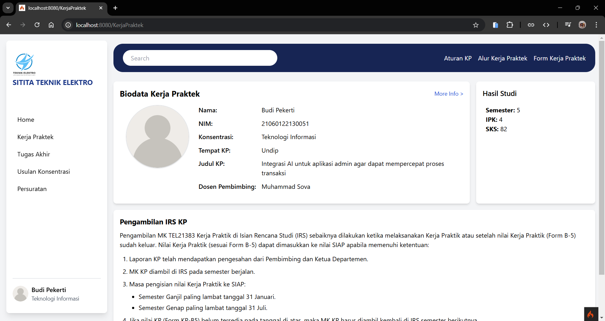
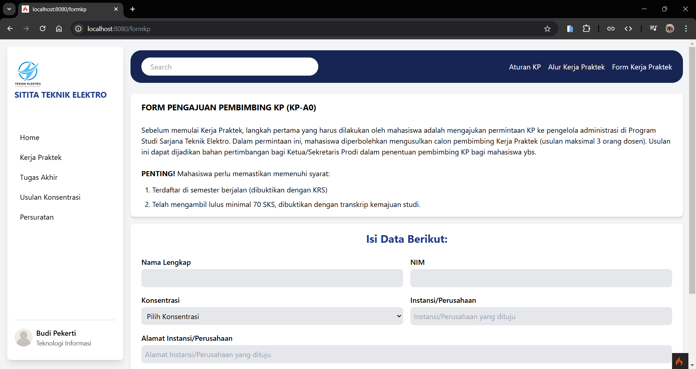
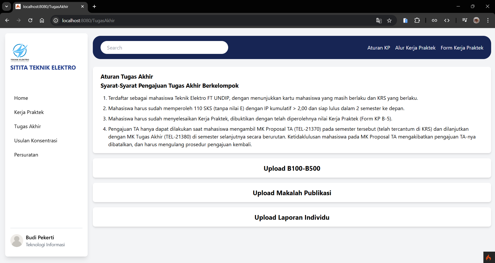
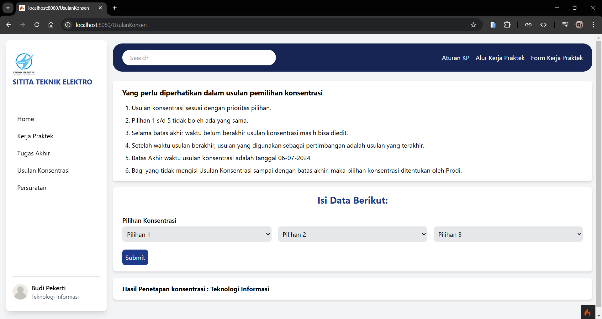

# School Administration Website


## Deskripsi Proyek
Website administrasi sekolah ini dibangun menggunakan **CodeIgniter 4** sebagai backend framework dan **Tailwind CSS** untuk desain antarmuka. Tujuan utama proyek ini adalah menyediakan platform yang user-friendly untuk membantu administrasi sekolah mengelola data secara efisien, seperti data mahasiswa, dosen, jadwal, hingga laporan.

## Project Member
- **Rifqi Naufal**
- **Muhammad Ridwan Slamat**
- **Muhammad Afiq Ramadhan Oktaviyanto**
- **Rayhan Muhammad Alfarizi**

## Screenshot
Berikut adalah beberapa tangkapan layar dari antarmuka website:


*Tampilan dashboard utama.*


*Tampilan halaman Kerja Praktek.*


*Tampilan halaman form untuk kerja praktek.*


*Tampilan tampilan untuk tugas akhir.*


*Tampilan untuk form mengajukan konsentrasi.*

## Fitur Utama
- **Manajemen Data Mahasiswa**: CRUD (Create, Read, Update, Delete) untuk data mahasiswa.
- **Manajemen Data Dosen**: CRUD untuk data dosen.
- **Laporan Akademik**: Pembuatan dan pengelolaan laporan akademik siswa.
- **Responsif**: Desain antarmuka yang responsif menggunakan Tailwind CSS.

## Teknologi yang Digunakan
- **Backend**: [CodeIgniter 4](https://codeigniter.com/)
- **Frontend**: [Tailwind CSS](https://tailwindcss.com/)
- **Database**: MySQL/MariaDB
- **Tooling**:
  - Composer (untuk dependency PHP)
  - NPM (untuk manajemen paket frontend)

## Persyaratan Sistem
- PHP versi 7.4 atau lebih baru.
- MySQL/MariaDB untuk basis data.
- Composer (untuk mengelola dependensi PHP).
- Node.js dan NPM (untuk mengelola Tailwind CSS).

## Instalasi

1. Clone repository ini ke local machine:

   ```bash
   git clone https://github.com/username/school-admin.git
   cd school-admin
   ```

2. Instal dependensi backend menggunakan Composer:

   ```bash
   composer install
   ```

3. Instal dependensi frontend menggunakan NPM:

   ```bash
   npm install
   ```

4. Konfigurasi file `.env` untuk mengatur database dan pengaturan lainnya:

   ```plaintext
   database.default.hostname = localhost
   database.default.database = nama_database
   database.default.username = nama_user
   database.default.password = password
   database.default.DBDriver = MySQLi
   ```

5. Jalankan migrasi untuk membuat tabel di database:

   ```bash
   php spark migrate
   ```

6. Jalankan proses build Tailwind CSS (development mode):

   ```bash
   npm run dev
   ```

7. Jalankan server CodeIgniter:

   ```bash
   php spark serve
   ```

8. Akses website melalui browser di [http://localhost:8080](http://localhost:8080).

## Struktur Proyek
```
project-root
├── app
│   ├── Config
│   ├── Controllers
│   ├── Models
│   └── Views
├── public
│   ├── assets
│   ├── css
│   └── js
├── writable
├── .env
├── tailwind.config.js
├── package.json
└── composer.json
```

**Catatan:** Pastikan untuk membaca dokumentasi resmi [CodeIgniter](https://codeigniter.com/docs) dan [Tailwind CSS](https://tailwindcss.com/docs) untuk memaksimalkan penggunaan framework ini.
